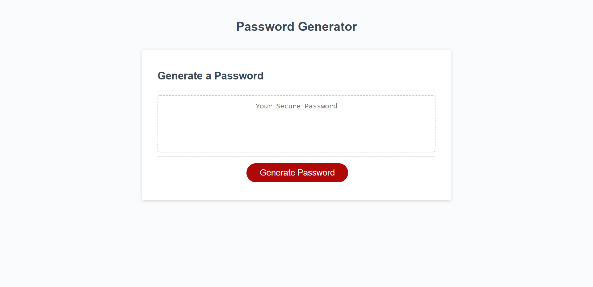

# Random Password Generator

## Table of Contents:
- [Description](#description)
- [Visuals](#visuals)
- [Resources](#resources)

## Description:
- In this assignment I have built a random password generator that will include at least one character from up to the 4 character types the user can choose from to use in their password. If they do not select any of the 4 character types then the user will be met with an alert telling them that their password will default to just symbols.
- I achieved the random list of characters that will be used for their password by first making four arrays that include all lower caseletters, uppercase letters, symbols and numbers. After that I made several functions that pick random characters from these arrays based on the character types the user wants as well as how long they want their password to be. Finally I made a function that will take those random characters and put them in a random order and used a return statement to display the newly generated password. 

## Visuals:

## Resources:
- [Repository](https://github.com/codytheroux96/generate-password)
- [Password Generator](https://codytheroux96.github.io/generate-password/)

